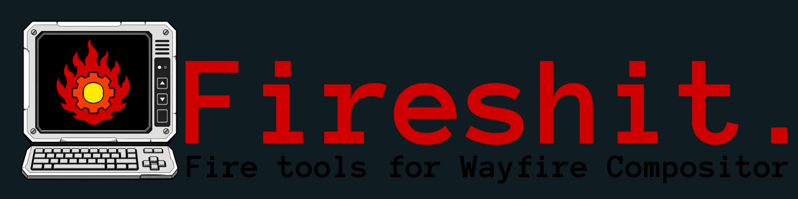

# Fireshit 1.1

Fireshit is a handcrafted utility suite for **Wayfire on Arch Linux**, combining persistent telemetry, application/output/region capture, and unified suite settings through three focused projects: **SUBSTR8 HUD**, **FrameTap**, and **Firemod**.

## License

Fireshit 1.1 is source-available software distributed under the **Fireshit Capture Immunity License, Version 0.1**. Inspection, local execution, modification, community redistribution, and independent interoperability are permitted under the license. Proprietary capture, paid rehosting, closed redistribution, and unauthorized commercial packaging are prohibited.

The previously published Fireshit 1.0 snapshot was distributed under MIT. FCIL applies to Fireshit 1.1 and later releases carrying the FCIL notice; it does not retroactively revoke rights already granted with 1.0. See `LICENSE_TRANSITION.md` for the exact boundary.

## Build and installation

All supported repository operations route through the root dispatcher:

```bash
./run.sh help
./run.sh build
./run.sh install
./run.sh legal-check
```

The installer preserves existing user configuration. Active SUBSTR8 HUD configuration lives under `${XDG_CONFIG_HOME:-$HOME/.config}/substr8-hud/`.

## Documentation

The public documentation opens on the project overview and includes a second tab for the complete searchable reference guide:

**[Read the Fireshit documentation](https://substr8games.github.io/Fireshit/)**



Project steward and licensing authority: **Giz@SUBSTR8Games**
